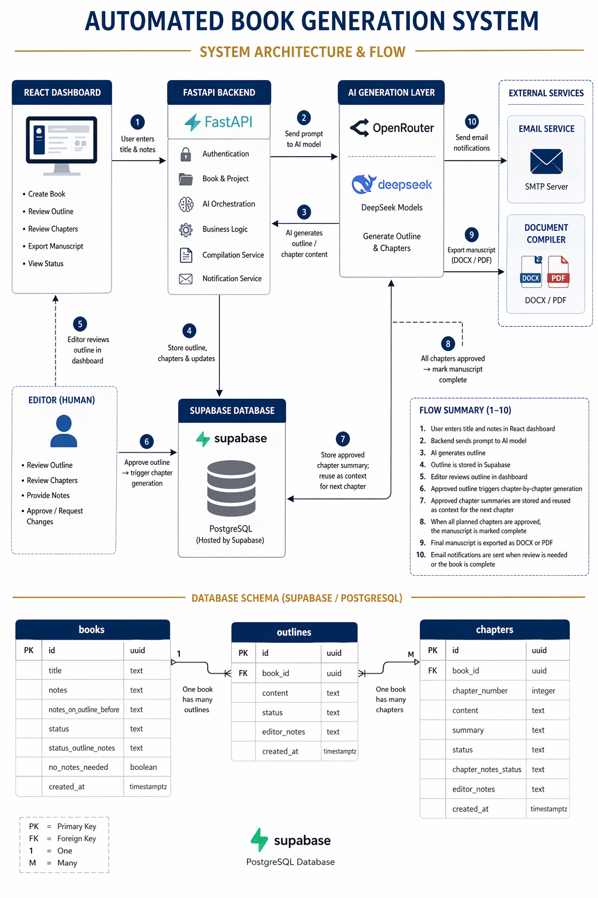
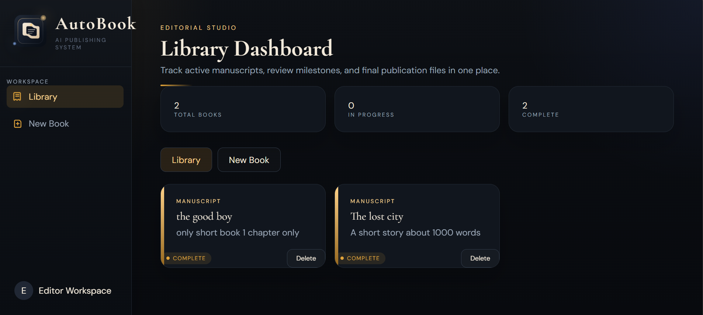
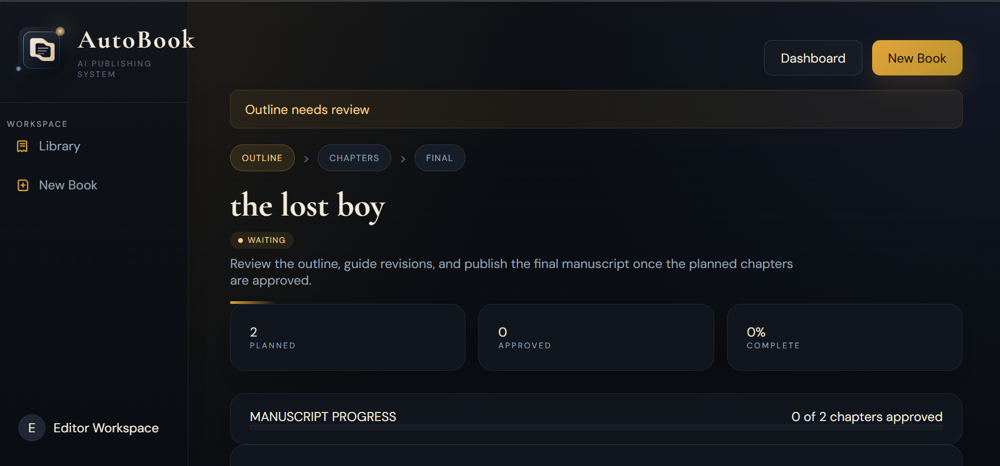
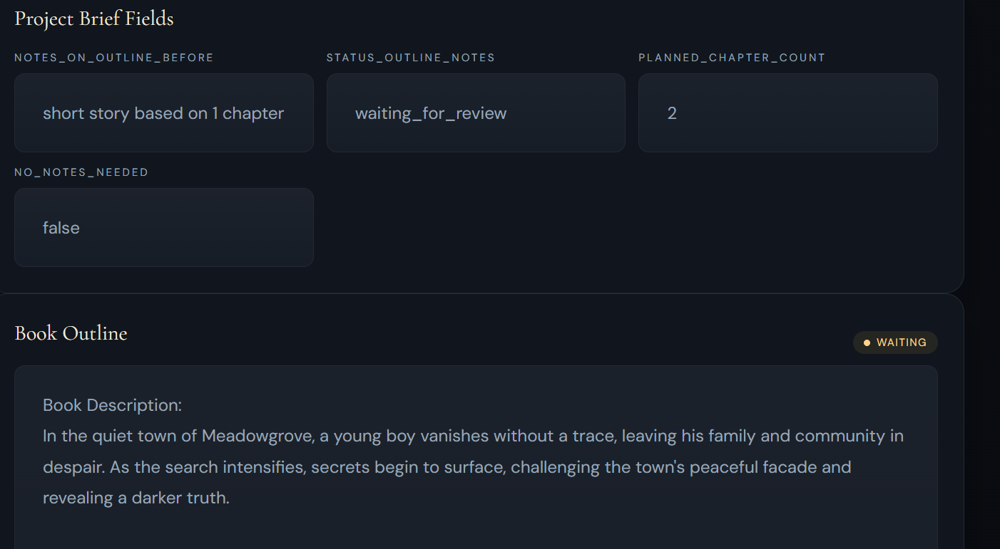
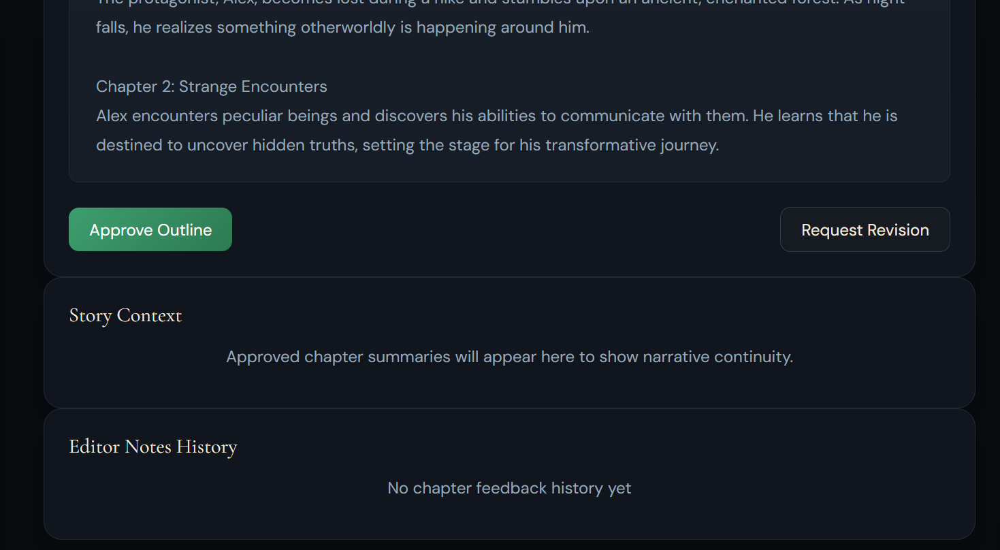
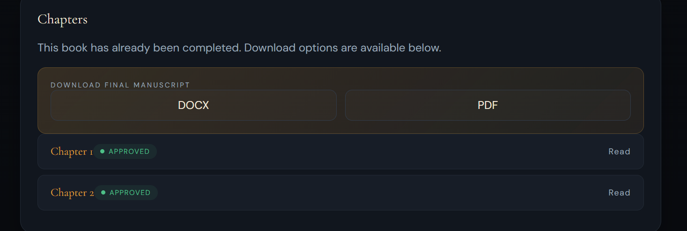
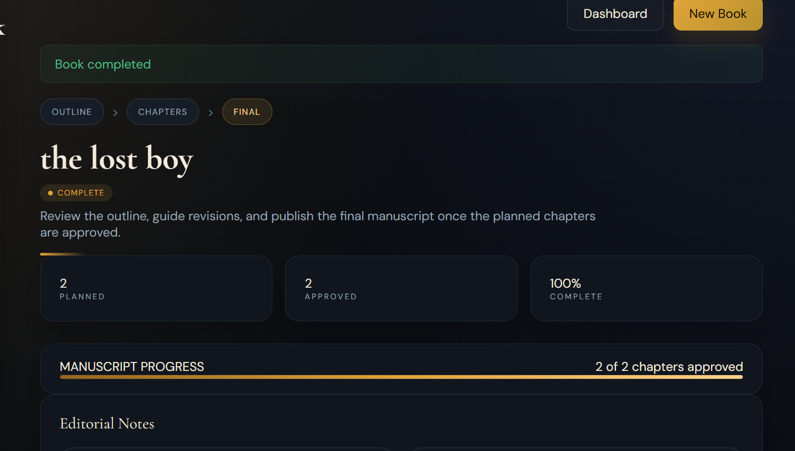
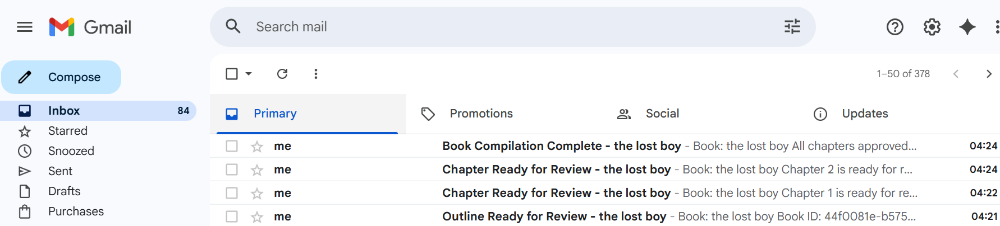

# Automated Book Generation System


An end-to-end AI publishing workflow that turns a title and editorial brief into a reviewable outline, sequential chapters, and a final manuscript export. The platform follows a human-in-the-loop editorial process so the editor can review, approve, revise, and monitor every important stage before publication.

## Table of Contents

- [Overview](#overview)
- [Architecture](#architecture)
- [Key Features](#key-features)
- [Tech Stack](#tech-stack)
- [Workflow](#workflow)
- [Brief-Aligned Fields](#brief-aligned-fields)
- [API Endpoints](#api-endpoints)
- [Local Development](#local-development)
- [Environment Variables](#environment-variables)
- [Project Structure](#project-structure)
- [Screenshots and Demo](#screenshots-and-demo)
- [Supporting Docs](#supporting-docs)
- [Submission Status](#submission-status)

## Overview

This project implements the workflow described in the project brief:

- ingest a title and pre-outline notes
- generate a gated outline for editorial review
- generate chapters sequentially after outline approval
- summarize approved chapters and reuse them as context for narrative continuity
- notify the editor when review is needed or the manuscript is complete
- export the final manuscript as `docx` or `pdf` after completion

## Architecture

The platform is organized into five main layers:

- `React Dashboard`
  Create books, review outlines, approve chapters, inspect brief-aligned fields, and export final manuscripts.
- `FastAPI Backend`
  Handles orchestration, workflow transitions, generation triggers, review gating, and export endpoints.
- `AI Generation Layer`
  Uses OpenRouter and DeepSeek-backed models for outline generation, chapter writing, and summarization.
- `Supabase Database`
  Stores books, outlines, chapters, summaries, review status, and brief-aligned fields.
- `Notification + Export Services`
  Sends SMTP email notifications and compiles final manuscripts into `docx` or `pdf`.



## Key Features

- Human-in-the-loop editorial workflow
- Gated outline approval and revision loop
- Sequential chapter generation
- Context-aware chapter generation using approved chapter summaries
- Planned chapter limit enforcement
- Automatic manuscript completion when all planned chapters are approved
- Email notifications for review milestones
- Spreadsheet import via `.csv` and `.xlsx`
- Final manuscript export in `docx` and `pdf`
- Project-brief field alignment across API, UI, and database support

## Tech Stack

- Backend: FastAPI
- Frontend: React + Vite
- Database: Supabase / PostgreSQL
- AI Providers: OpenRouter and DeepSeek
- Export: `python-docx`, `reportlab`
- Notifications: SMTP email, optional Microsoft Teams webhook

## Workflow

1. Create a book from a title and editorial notes.
2. Generate an outline and pause for editorial review.
3. Approve the outline or request revision.
4. Generate chapters in sequence.
5. Approve or revise each chapter.
6. Save a summary for every approved chapter.
7. Reuse stored summaries as context for the next chapter.
8. Mark the manuscript complete once all planned chapters are approved.
9. Export the final manuscript as `docx` or `pdf`.

## Brief-Aligned Fields

The system supports the project brief naming directly in the UI and API:

- `notes_on_outline_before`
- `status_outline_notes`
- `chapter_notes_status`
- `no_notes_needed`

These fields map to the outline review lifecycle, chapter review lifecycle, and final approval state required by the brief.

## API Endpoints

| Method | Endpoint | Purpose |
| --- | --- | --- |
| `GET` | `/` | Health check |
| `POST` | `/books/create-stream` | Create a book and stream outline generation |
| `POST` | `/books/import` | Import books from `.csv` or `.xlsx` |
| `GET` | `/books` | List books |
| `GET` | `/books/{id}` | Get book details and latest outline |
| `POST` | `/books/{id}/feedback` | Approve or revise an outline |
| `GET` | `/books/{id}/chapters` | List chapters for a book |
| `POST` | `/books/{id}/generate-chapter-stream` | Stream the next chapter |
| `POST` | `/chapters/{id}/feedback` | Approve or revise a chapter |
| `GET` | `/books/{id}/compile?format=docx` | Export final DOCX |
| `GET` | `/books/{id}/compile?format=pdf` | Export final PDF |

## Local Development

### Backend

From the project root:

```powershell
pip install -r requirements.txt
uvicorn backend.main:app --reload
```

Or from inside `backend/`:

```powershell
python run_backend.py
```

### Frontend

```powershell
cd frontend
npm install
npm run dev
```

## Environment Variables

Backend:

```env
SUPABASE_URL=your_supabase_url
SUPABASE_KEY=your_supabase_key
OPENROUTER_API_KEY=your_openrouter_api_key
DEEPSEEK_API_KEY=your_deepseek_api_key
DEEPSEEK_MODEL=deepseek-chat
SMTP_HOST=
SMTP_PORT=587
SMTP_USER=
SMTP_PASSWORD=
SMTP_TO=
TEAMS_WEBHOOK=
```

Frontend:

```env
VITE_API_URL=http://127.0.0.1:8000
```

## Project Structure

```text
backend/
  routes/
  services/
  main.py

frontend/
  src/
  public/

docs/
  schema.md
  submission_checklist.md
  import_template.csv
  supabase_brief_column_migration.sql
  images/
```

## Screenshots and Demo

### Dashboard Overview



The library dashboard shows manuscript cards, high-level counts, and the main editorial workspace entry point.

### Outline Review



This screen shows a manuscript waiting for outline review, planned chapter count, and the workflow stage indicator.

### Brief-Aligned Fields



The dashboard exposes the brief-style fields directly in the UI, including `notes_on_outline_before`, `status_outline_notes`, `planned_chapter_count`, and `no_notes_needed`.

### Outline Actions and Story Context



The editor can approve the outline or request revision before chapter generation continues.

### Completion State



Once all planned chapters are approved, the manuscript is marked complete and the progress indicators update accordingly.

### Final Export



The final manuscript can be downloaded in `docx` or `pdf` once completion is reached.

### Email Notifications



The system sends email notifications when the outline is ready, when chapters are ready for review, and when the manuscript is complete.

### Final Submission Assets

- one sample manuscript export
- one short walkthrough video

For the full checklist and demo script, see [docs/submission_checklist.md](docs/submission_checklist.md).

## Supporting Docs

- Schema reference: [docs/schema.md](docs/schema.md)
- Submission checklist and demo script: [docs/submission_checklist.md](docs/submission_checklist.md)
- Spreadsheet import template: [docs/import_template.csv](docs/import_template.csv)
- Optional Supabase brief-column migration: [docs/supabase_brief_column_migration.sql](docs/supabase_brief_column_migration.sql)

## Submission Status

Implementation-wise, the system covers the core technical requirements in the project brief:

- gated outline pipeline
- context-aware chapter generation
- monitoring dashboard
- notification support
- final manuscript compilation
- spreadsheet-based input seeding

The remaining work for final submission is mainly packaging:

- capture dashboard screenshots
- export one polished sample manuscript
- record the demo video
